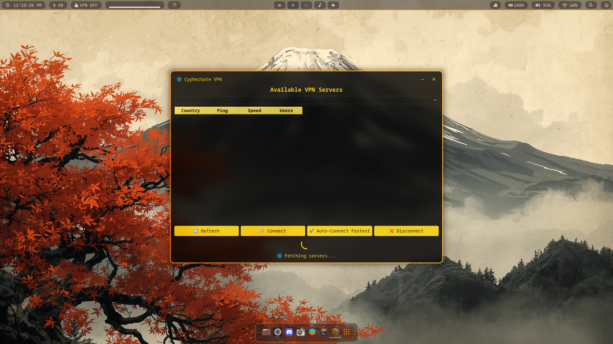
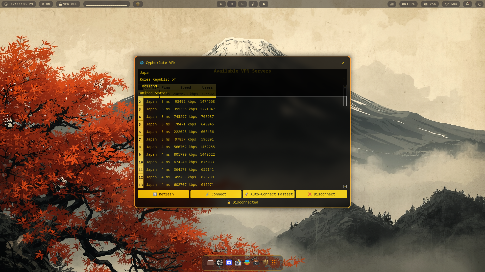
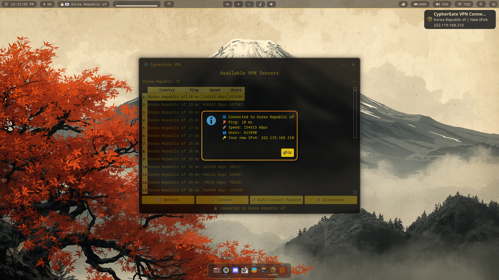
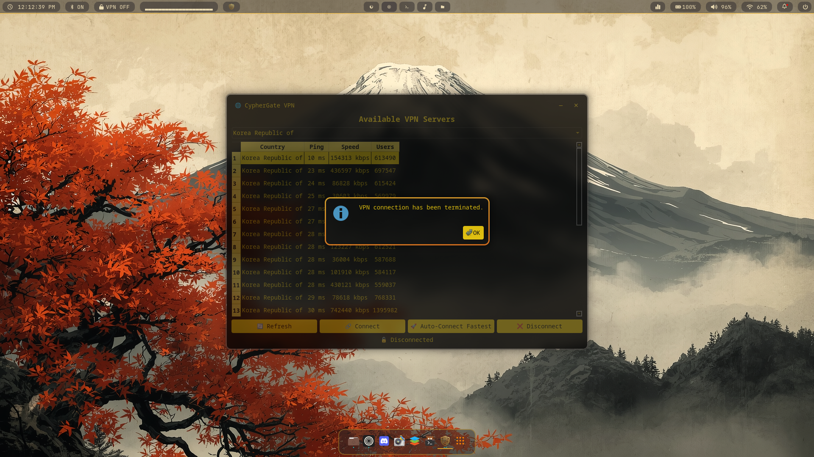

# CypherGate

[](https://aur.archlinux.org/packages/cyphergatevpn-bin)
[](https://github.com/Cypher-Monarch/CypherGate/releases)
[](LICENSE)

---

## CypherGate

> *“Anyone can hide. Few remain hidden.”*

I made this because VPNGate configs are… let’s just say
**not exactly plug-and-play** 💀

CypherGate:

* fetches servers
* fixes their broken configs
* connects without asking you to debug nonsense

So yeah:

> click → connect → done

---

## 🖼️ Screenshots

<p align="center">
  
  
</p>
<p align="center">
  
  
</p>

---

## ⚡ What it does (without the marketing talk)

* 🌐 grabs live VPNGate servers
* 🛠️ auto-fixes configs that shouldn’t have been broken in the first place
* 🎨 runs a gold-on-black Qt GUI (yes it’s opinionated, no I won’t apologize)
* 🖥️ also has a TUI if you live in the terminal
* 🚀 lets you:

  * auto-connect
  * pick manually
  * or just go “fastest server pls”
* 📦 caches servers so you’re not stuck when offline
* 📝 logs everything (for your ~paranoia~ curiosity)
* 🔔 sends notifications so you know what’s going on

---

## 🧠 Why this exists

Because I got tired of:

* broken configs
* outdated ciphers
* “just edit this file manually bro”

So I made something that:

> just handles it

---

## ⚙️ Requirements (TUI only)

* `bash`
* `curl`
* `base64`
* `whiptail`
* `openvpn`
* `notify-send`

---

## 📂 Where stuff goes

```bash
~/.config/cyphergate/
```

Logs:

* Linux → `~/.config/cyphergate/logs`
* Windows → `%USERPROFILE%\.config\cyphergate\logs`

---

## 📦 Installation

### Arch

```bash
yay -S cyphergatevpn-bin
```

---

### Linux (general)

```bash
wget -qO- https://github.com/Cypher-Monarch/CypherGate/releases/download/v2.0.0/install.sh | sudo bash
```

---

### Windows

* Installer → [Here you go](https://github.com/Cypher-Monarch/CypherGate/releases/download/v1.0.1/CypherGateInstaller-v1.0.1.exe)
* Portable → [There you go](https://github.com/Cypher-Monarch/CypherGate/releases/download/v1.0.1/CypherGate-Windows-v1.0.1.zip)

---

## 🖥️ Usage

* Linux GUI → launch **CypherGate VPN**
* Linux TUI → `cyphergate.sh`
* Windows → Start Menu / `CypherGate.exe`

---

## ⚡ Final note

This is:

> **very opinionated**

It looks how I want it to look
and works how I want it to work

If you like that:

> you’ll probably enjoy using it

If not:

> well… at least it fixes your configs 😭
