# CypherGate Theme Showcase

CypherGate ships with a collection of builtin themes.

Builtin themes are installed to:

```text
/usr/share/cyphergate/themes
```

Each theme also includes a ready-to-use settings preset under:

```text
/usr/share/cyphergate/themes/examples
```

## Builtin Themes

<details>
<summary><strong>Default</strong></summary>

### Screenshot

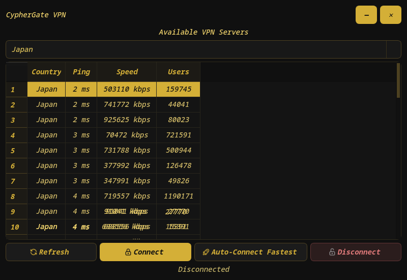

### Usage

```bash
cp /usr/share/cyphergate/themes/examples/example-default.json \
   ~/.config/cyphergate/settings.json
```

</details>

<details>
<summary><strong>Bloodline</strong></summary>

### Screenshot

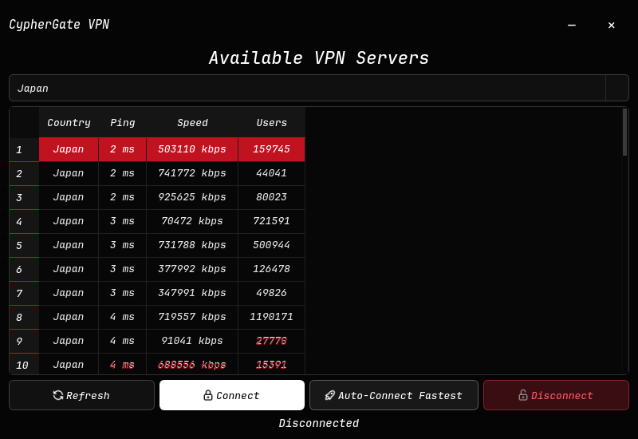

### Usage

```bash
cp /usr/share/cyphergate/themes/examples/example-bloodline.json \
   ~/.config/cyphergate/settings.json
```

</details>

<details>
<summary><strong>Biohazard</strong></summary>

### Screenshot

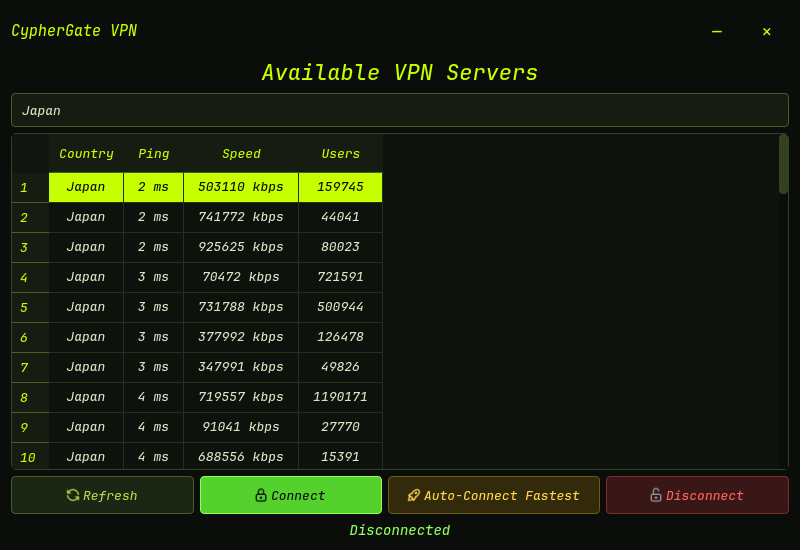

### Usage

```bash
cp /usr/share/cyphergate/themes/examples/example-biohazard.json \
   ~/.config/cyphergate/settings.json
```

</details>

<details>
<summary><strong>Dracula</strong></summary>

### Screenshot

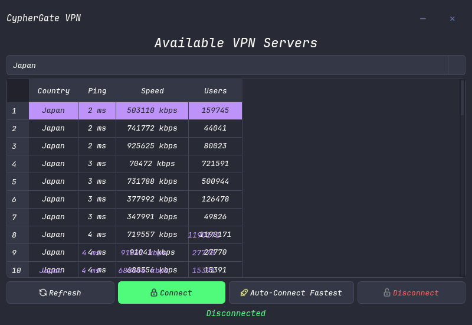

### Usage

```bash
cp /usr/share/cyphergate/themes/examples/example-dracula.json \
   ~/.config/cyphergate/settings.json
```

</details>

<details>
<summary><strong>Everforest</strong></summary>

### Screenshot

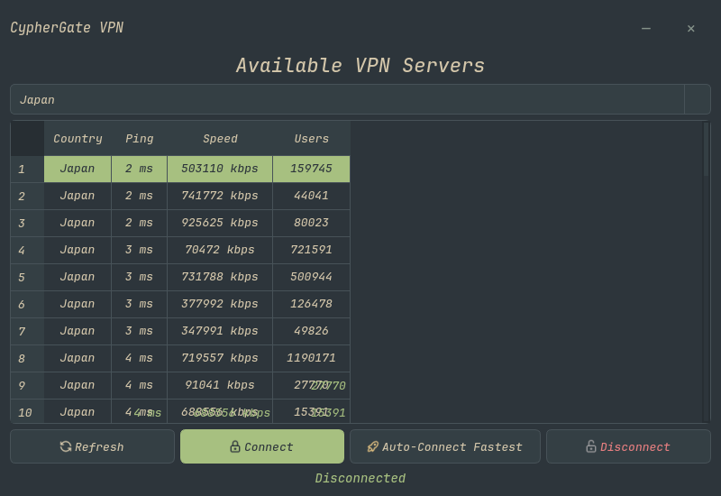

### Usage

```bash
cp /usr/share/cyphergate/themes/examples/example-everforest.json \
   ~/.config/cyphergate/settings.json
```

</details>

<details>
<summary><strong>Gruvbox</strong></summary>

### Screenshot

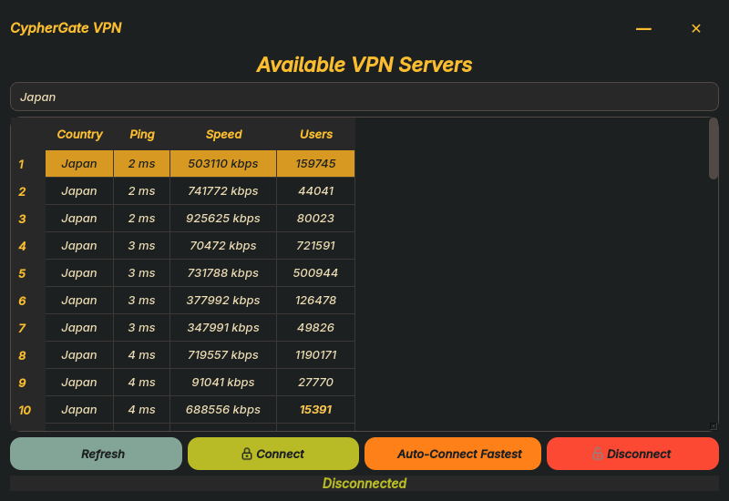

### Usage

```bash
cp /usr/share/cyphergate/themes/examples/example-gruvbox.json \
   ~/.config/cyphergate/settings.json
```

</details>

<details>
<summary><strong>Kanagawa</strong></summary>

### Screenshot

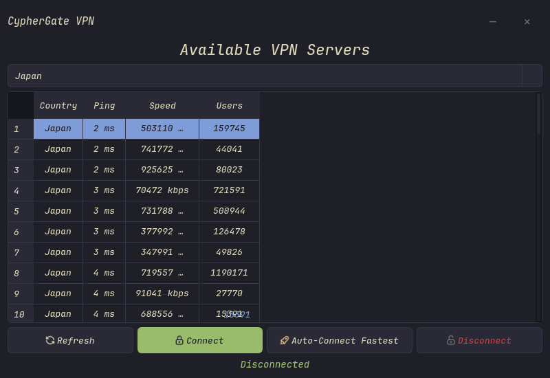

### Usage

```bash
cp /usr/share/cyphergate/themes/examples/example-kanagawa.json \
   ~/.config/cyphergate/settings.json
```

</details>

<details>
<summary><strong>Monokai</strong></summary>

### Screenshot

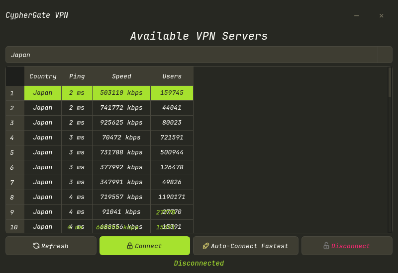

### Usage

```bash
cp /usr/share/cyphergate/themes/examples/example-monokai.json \
   ~/.config/cyphergate/settings.json
```

</details>

<details>
<summary><strong>Nord</strong></summary>

### Screenshot

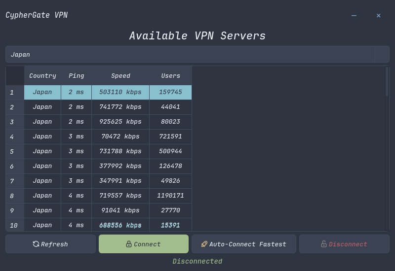

### Usage

```bash
cp /usr/share/cyphergate/themes/examples/example-nord.json \
   ~/.config/cyphergate/settings.json
```

</details>

<details>
<summary><strong>One Dark</strong></summary>

### Screenshot

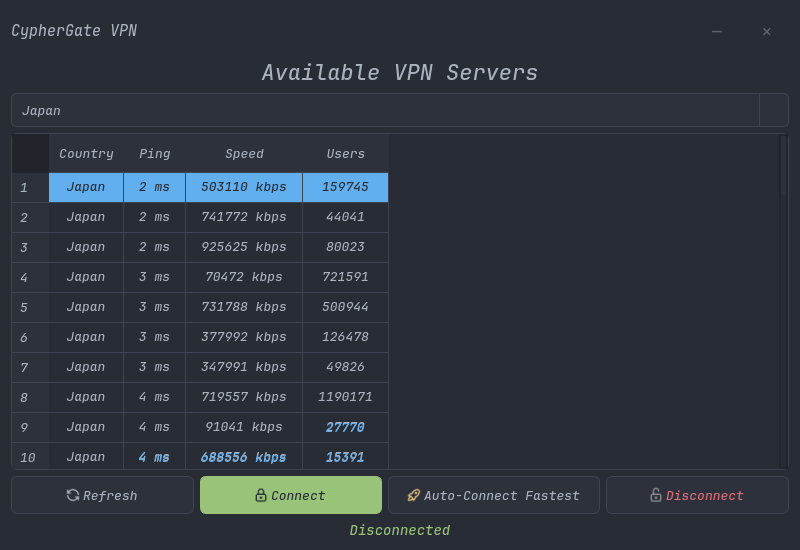

### Usage

```bash
cp /usr/share/cyphergate/themes/examples/example-one_dark.json \
   ~/.config/cyphergate/settings.json
```

</details>

<details>
<summary><strong>Operator</strong></summary>

### Screenshot

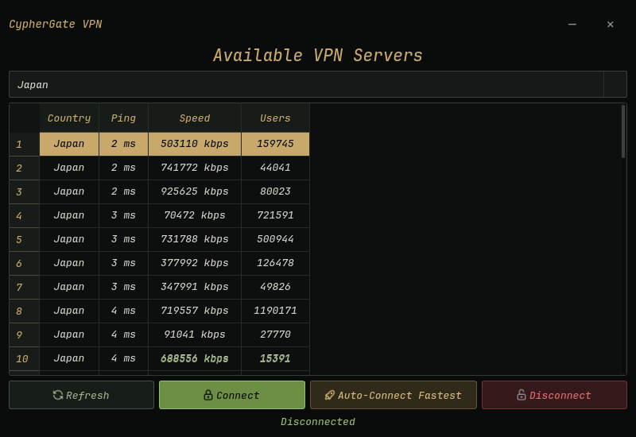

### Usage

```bash
cp /usr/share/cyphergate/themes/examples/example-operator.json \
   ~/.config/cyphergate/settings.json
```

</details>

<details>
<summary><strong>Pastel Orange</strong></summary>

### Screenshot

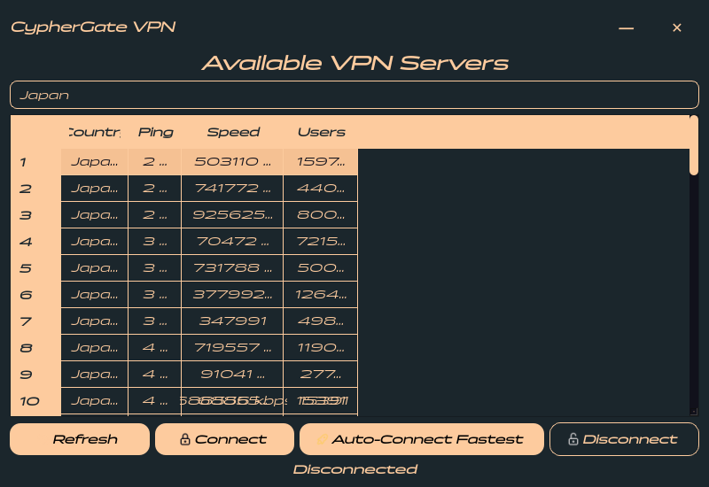

### Usage

```bash
cp /usr/share/cyphergate/themes/examples/example-pastel-orange.json \
   ~/.config/cyphergate/settings.json
```

</details>

<details>
<summary><strong>Playful</strong></summary>

### Screenshot

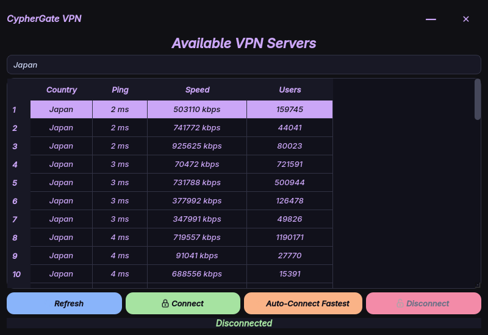

### Usage

```bash
cp /usr/share/cyphergate/themes/examples/example-playful.json \
   ~/.config/cyphergate/settings.json
```

</details>

<details>
<summary><strong>Rosé Pine</strong></summary>

### Screenshot

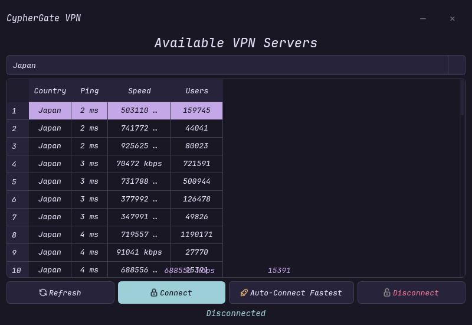

### Usage

```bash
cp /usr/share/cyphergate/themes/examples/example-rose_pine.json \
   ~/.config/cyphergate/settings.json
```

</details>

<details>
<summary><strong>Tokyo Night</strong></summary>

### Screenshot

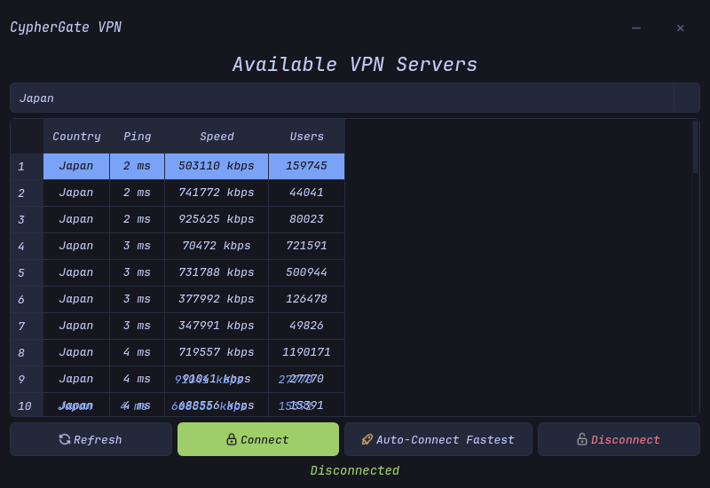

### Usage

```bash
cp /usr/share/cyphergate/themes/examples/example-tokyo_night.json \
   ~/.config/cyphergate/settings.json
```

</details>

<details>
<summary><strong>Void</strong></summary>

### Screenshot

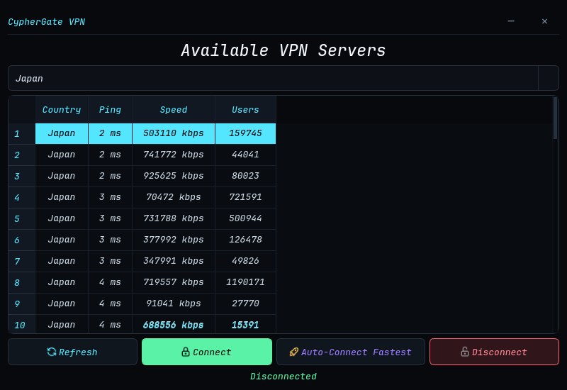

### Usage

```bash
cp /usr/share/cyphergate/themes/examples/example-void.json \
   ~/.config/cyphergate/settings.json
```

</details>

<details>
<summary><strong>Win32</strong></summary>

### Screenshot

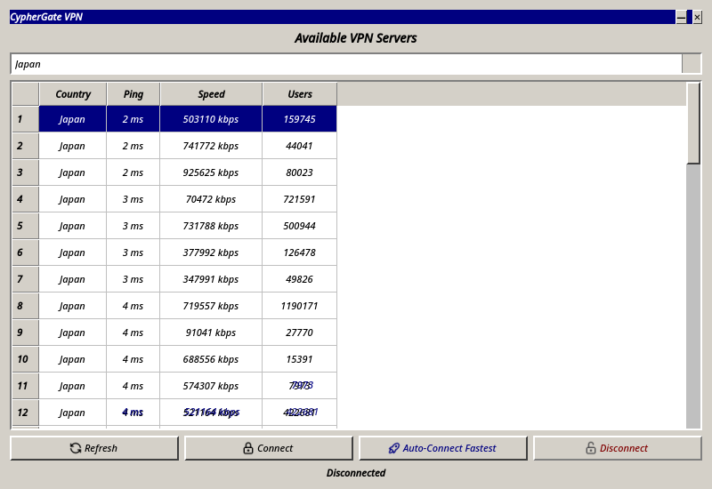

### Usage

```bash
cp /usr/share/cyphergate/themes/examples/example-win32.json \
   ~/.config/cyphergate/settings.json
```

</details>

## Custom Themes

CypherGate also supports custom QSS themes loaded from an arbitrary path.
See [Theming](docs/theming.md) for details on creating, selecting, and hot-reloading custom themes.
